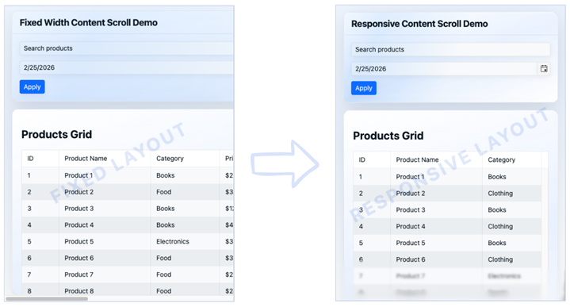
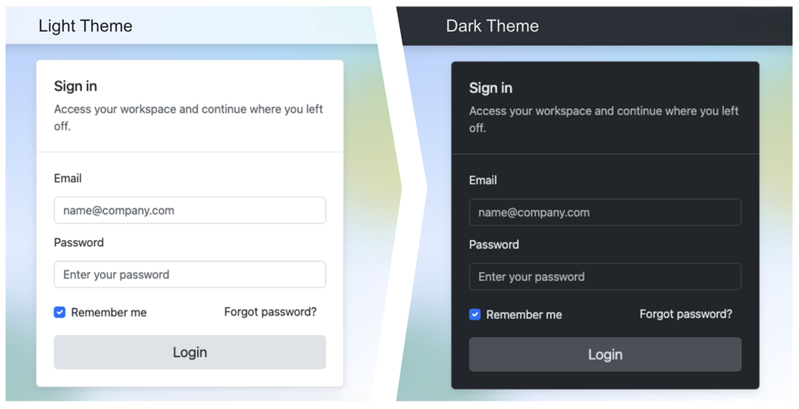
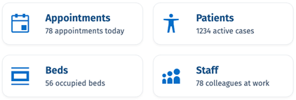

# Telerik UI for ASP.NET Core AI Tools Overview

The Telerik UI for ASP.NET Core AI Tools are delivered through a single [Model Context Protocol (MCP) server](https://modelcontextprotocol.io/docs/getting-started/intro) that connects your AI client to UI-generation capabilities and knowledge specific to Telerik UI for ASP.NET Core.

From idea to implementation, you can use the MCP server to generate complete pages, configure components correctly, align with the Progress Design System, and reduce repetitive setup work.

## What Are the Telerik UI for ASP.NET Core AI Tools

The Telerik ASP.NET Core MCP Server is a local MCP server that is distributed through the [Telerik.AspNetCore.MCP](https://www.nuget.org/packages/Telerik.AspNetCore.MCP) NuGet package.

The Telerik ASP.NET Core MCP server uses an orchestration-first model, centered on the Agentic UI Generator tool. It contains a core set of specialized assistants. Click the cards below for more details on each assistant:

<Row>
    <Column count={[24,12,8]}>
        <Component className="tile card-icon" href="#how-the-agentic-flow-works">
            <ComponentTitle>UI Generator (Orchestrator)</ComponentTitle>
        </Component>
    </Column>
    <Column count={[24,12,8]}>
        <Component className="tile card-icon" href="#getting-started-assistant">
            <ComponentTitle>Getting Started Assistant</ComponentTitle>
        </Component>
    </Column>
    <Column count={[24,12,8]}>
        <Component className="tile card-icon" href="#component-assistant">
            <ComponentTitle>Component Assistant</ComponentTitle>
        </Component>
    </Column>
    <Column count={[24,12,8]}>
        <Component className="tile card-icon" href="#icon-assistant">
            <ComponentTitle>Icon Assistant</ComponentTitle>
        </Component>
    </Column>
    <Column count={[24,12,8]}>
        <Component className="tile card-icon" href="#layout-assistant">
        <ComponentTitle>Layout Assistant</ComponentTitle>
        </Component>
    </Column>
    <Column count={[24,12,8]}>
        <Component className="tile card-icon" href="#styling-assistant">
        <ComponentTitle>Styling Assistant</ComponentTitle>
    </Column>
    <Column count={[24,12,8]}>
      <Component className="tile card-icon" href="#accessibility-assistant">
        <ComponentTitle>Accessibility Assistant</ComponentTitle>
        </Component>
    </Column>
    <Column count={[24,12,8]}>
      <Component className="tile card-icon" href="#validator-assistant">
        <ComponentTitle>Validator Assistant</ComponentTitle>
        </Component>
    </Column>
    <Column count={[24,12,8]}>
      <Component className="tile card-icon" href="#upgrade-assistant">
        <ComponentTitle>Upgrade Assistant</ComponentTitle>
        </Component>
    </Column>
</Row>

The Agentic UI Generator orchestrates all assistants so you can build pages and components, apply styling and theming, and stay aligned with the design system in one seamless process. You can use the full end-to-end flow when you need complete page generation, or call a specific assistant directly when you need a focused change.

>info The previously available `Telerik.ASPNETCoreHtml.MCP` and `Telerik.ASPNETCoreTag.MCP` packages will be deprecated in favor of the Agentic UI Generator.

## How the Agentic Flow Works

The Agentic UI Generator takes one prompt and manages the flow for you. It decides which assistants to use and combines their output into a single result. Use it when you want to generate a full page quickly, or call a specific assistant when you need a focused update to the layout, components, styling, theme, or icons in your project.

### Getting Started Assistant

Use the Getting Started Assistant when you want a guided onboarding flow for first-time setup. Call it to scaffold an ASP.NET Core project, configure the Telerik MCP server, set up Telerik UI for ASP.NET Core in the project, and complete license activation with minimal manual steps.

It is useful when setting up a new environment, validating your initial MCP integration, or preparing a clean proof of concept quickly.

### Layout Assistant

Use the Layout Assistant to set up or refine the page structure. It helps with section order, spacing, and responsive behavior so the UI stays clear across desktop, tablet, and mobile.

Typical tasks include adding a new dashboard section, cleaning up visual hierarchy, and converting desktop-first screens into responsive layouts.

### Component Assistant

Use the Component Assistant when you need help configuring Telerik UI for ASP.NET Core components. It helps you choose the right component with the desired syntax flavor and configure it correctly using real API patterns.

Common tasks include enabling Grid features (sorting, paging, filtering, grouping), building validated forms, setting up virtual scrolling or export, and using sample data for safe prototyping.

### Styling Assistant

Use the Styling Assistant when you want consistent visuals across the app. It helps define reusable tokens and CSS variables for scalable theming.

Typical tasks include applying brand colors, adding dark mode or high-contrast variants, and keeping styling behavior consistent as new pages are added.

### Icon Assistant

Use the Icon Assistant to choose icons that match user actions and UI context. This assistant helps you achieve visually consistent navigation, status indicators, and action buttons.

It is useful for toolbars, navigation menus, cards, and any new section where icon consistency matters.

### Accessibility Assistant

Use the Accessibility Assistant to apply WCAG 2.2 Level AA guidance during implementation, not after it. It helps with ARIA usage, keyboard navigation, semantic markup, and color contrast validation for text and UI controls.
It is especially useful for interactive templates, complex component flows, and final semantic checks before release.

### Validator Assistant

The Validator Assistant is not designed to be invoked manually. The UI Generator Orchestrator calls it automatically to ensure that the generated code follows Telerik UI for ASP.NET Core best practices and standards.

### Upgrade Assistant

Use the Upgrade Assistant to update the `Telerik UI for ASP.NET Core` NuGet package to the latest version and automatically resolve breaking changes. If breaking changes are introduced in the release, the assistant automatically resolves them or provides guidance on how to resolve them.

### When to Use Orchestrated vs Targeted Mode

Use `#telerik_ui_generator` for a complete orchestration-first workflow from a single prompt. When you need finer control or want to adjust just one aspect (such as layout, theme, or a component), you can call a specialized assistant directly by its dedicated handle. For details, see [Target the Assistants (Advanced)](slug:agentic-ui-generator-prompt-library-core#assistant-specific-prompts).

## Start Building in Minutes

Go from zero setup to your first generated UI quickly with the smart Getting Started assistant. Start with [Agentic UI Generator Getting Started](slug:agentic-ui-generator-getting-started-core) for a simple, guided flow through Telerik CLI installation, MCP setup, license activation, and your first prompt.

Explore the [Agentic UI Generator Prompt Library](slug:agentic-ui-generator-prompt-library-core) for ready-to-use prompts covering common UI scenarios.

## License Requirements

The Telerik UI for ASP.NET Core MCP server and its tools are offered as a single experience through the **Agentic UI Generator** (`#telerik_ui_generator`) in [all active Telerik subscription licenses](https://www.telerik.com/purchase.aspx?filter=web).

<table>
<colgroup>
<col style="width: 40%">
<col style="width: 30%">
</colgroup>
<thead>
<tr>
<th>License Type</th>
<th>Agentic UI Generator</th>
</tr>
</thead>
<tbody>
<tr>
<td><strong>Subscription License</strong>
</td>
<td><svg xmlns="http://www.w3.org/2000/svg" width="24" height="24" viewBox="0 0 24 24"><path d="M20.285 2l-11.285 11.567-5.286-5.011-3.714 3.716 9 8.728 15-15.285z" stroke="white" stroke-width="2"/></svg></td>
</tr><tr>
<td><strong>Trial License</strong></td>
<td><svg xmlns="http://www.w3.org/2000/svg" width="24" height="24" viewBox="0 0 24 24"><path d="M20.285 2l-11.285 11.567-5.286-5.011-3.714 3.716 9 8.728 15-15.285z" stroke="white" stroke-width="2"/></svg></td>
</tr>
<tr>
<td><strong>Perpetual License</strong></td>
<td>No*</td>
</tr>

</tbody>
</table>

<em>
*  All AI tools are available with a <a href="https://www.telerik.com/mcp-servers-aspnet-core/thank-you">30-day AI Tools trial</a> or <a href="https://www.telerik.com/try/aspnet-core-ui">a Telerik UI for ASP.NET Core trial</a>.
</em>  

## Privacy

The Telerik MCP server operates under the following conditions:

* The MCP server does not have access to your workspace or application code. Note that when using the Telerik MCP server (or any other MCP server), the LLM generates parameters for the MCP server request, which may include parts of your application code.
* The MCP server does not use your prompts to train Telerik AI models.
* The MCP server does not generate the actual responses and has no access to them. The MCP server only provides context that helps your selected model (for example, GPT, Gemini, or Claude) produce better responses.
* The MCP server does not associate your prompts with your Telerik user account. Your prompts and generated context are anonymized and stored for statistical and troubleshooting purposes.

## Next Steps

* [Agentic UI Generator Getting Started](slug:agentic-ui-generator-getting-started-core)
* [Agentic UI Generator Prompt Library](slug:agentic-ui-generator-prompt-library-core)

## See Also

* [MCP Clients](https://modelcontextprotocol.io/clients)
* [Changelog](slug:ai_coding_assistant_release_notes_aspnet-core)

