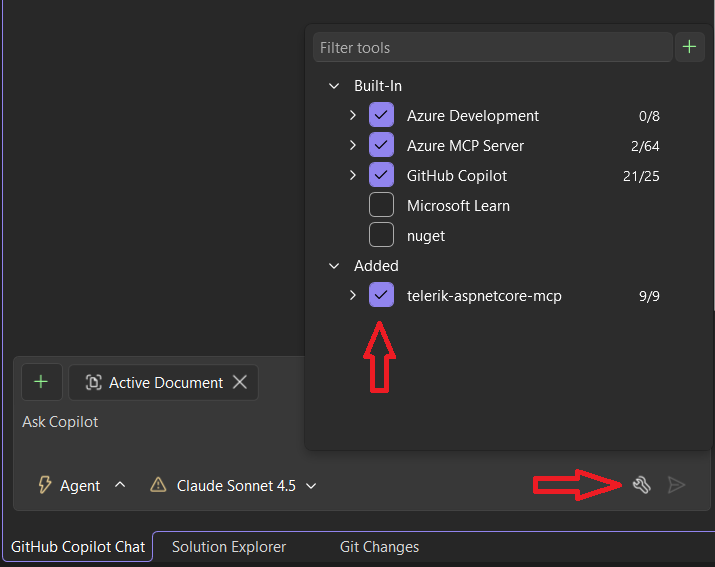

# Troubleshooting

This article provides solutions to common issues you may encounter when working with the Telerik UI for ASP.NET Core AI tools.

## Permission Denied (No Valid License)

The Telerik MCP server may exit unexpectedly with the following error:

`gRPC error in ValidateUserLicenseAsync: PermissionDenied - no valid license found for the requested product`

The error means one of the following:

* You have a legacy *Perpetual* license, while the Telerik AI tools require a *Subscription* license.
* Your Telerik UI for ASP.NET Core Subscription license has expired.
* Your Telerik UI for ASP.NET Core trial or AI Tools trial has expired.
* The Telerik license key on your computer [needs updating](slug:installation_license_key_aspnetcore#license-key-updates).

> Telerik Subscription licenses were introduced in 2025 and explicitly contain the word "Subscription" in their name. Examples include:
>
> * DevCraft Ultimate Subscription
> * DevCraft Complete Subscription
> * DevCraft UI Subscription
> * Telerik UI for Blazor Subscription
>
> An automatically renewing license is not necessarily a Subscription license.

For detailed information about license requirements and tool capabilities, see [License Requirements](slug:overview_ai#usage-limits).

## I Started a Trial License but Cannot Activate the MCP Server

When you activate a trial license, download and install the updated license key to enable access to the AI tools. To resolve this issue:

1. Follow the steps in the [License Key Updates](slug:installation_license_key_aspnetcore#license-key-updates) section.
1. Restart your IDE to ensure the changes take effect.

The MCP server validates your license during initialization. Without a properly activated license key, the server cannot authenticate your access to the AI Tools.

## MCP Assistants Not Recognized by Visual Studio

If the Telerik ASP.NET Core MCP server tools are not available or recognized by GitHub Copilot in Visual Studio, you may need to manually enable them:

1. Click the *Select Tools* button in the lower-right corner of the Copilot chat window.
1. In the pop-up window, select **telerik-aspnetcore-mcp** from the list to enable the server that matches your project.



## Hanging Tool Calls in Visual Studio

When using Telerik AI tools in Visual Studio, GitHub Copilot may:
* **Hang** during tool invocation.
* Show UI for a successful tool response, but actually **fail silently**.
* Continue generation without waiting for **parallel tool calls**.

This is a [known issue](https://developercommunity.visualstudio.com/t/Copilot-stopped-working-after-latest-upd/10936456) in older Visual Studio versions that has been fixed in Visual Studio 2026 Insiders 18.3.0 (11426.168).

## Unable to Establish HTTP/2 Connection

The Telerik ASP.NET Core AI tools depend on gRPC, which requires HTTP/2. If the client device does not support HTTP/2 or the protocol is disabled, the following exception occurs:

````TEXT.skip-repl
HttpRequestException: Requesting HTTP version 2.0 with version policy RequestVersionExact while unable to establish HTTP/2 connection.
````

In this case, enable HTTP/2 on the client device and any related firewalls or proxy servers in the network.

## See Also

* [Telerik UI for ASP.NET Core AI Tools Overview](slug:ai-overview-core)
* [Getting Started](slug:agentic-ui-generator-getting-started-core)
* [Telerik UI for ASP.NET Core AI Coding Assistant Overview](slug:overview_ai)
* [Licensing](slug:installation_license_key_aspnetcore)
